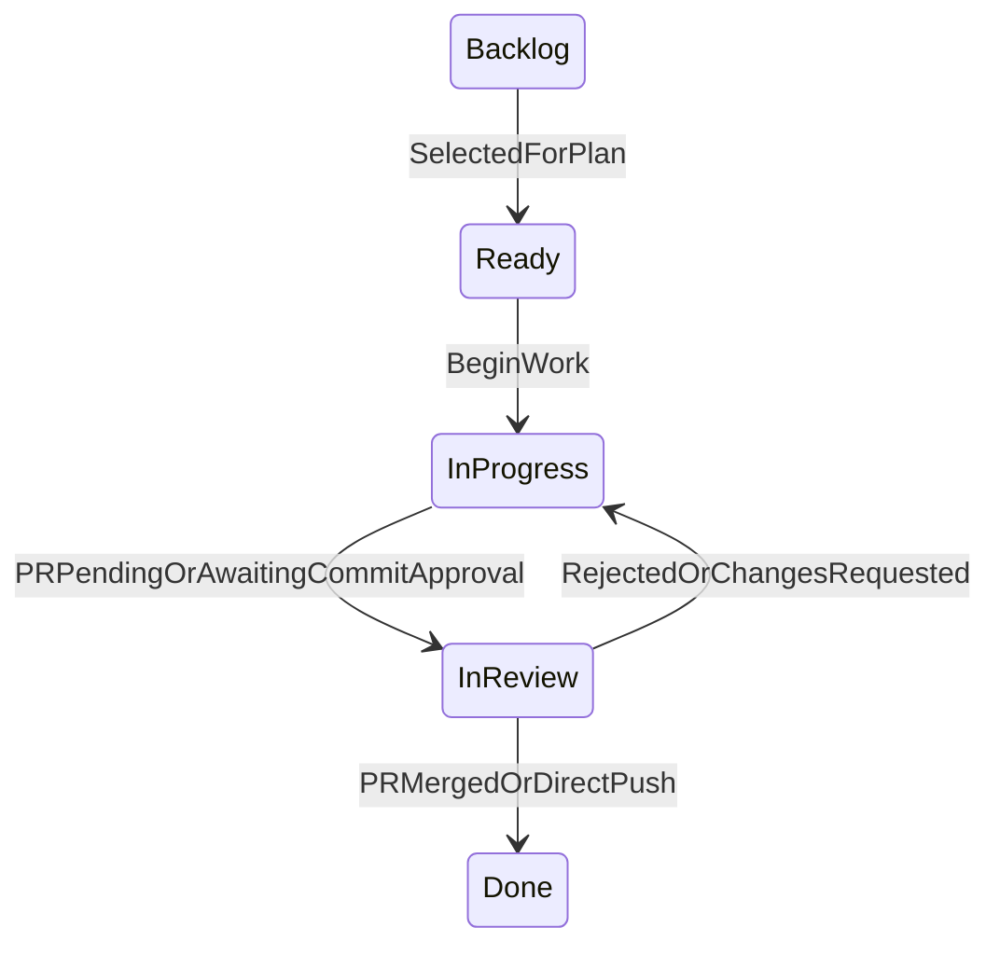
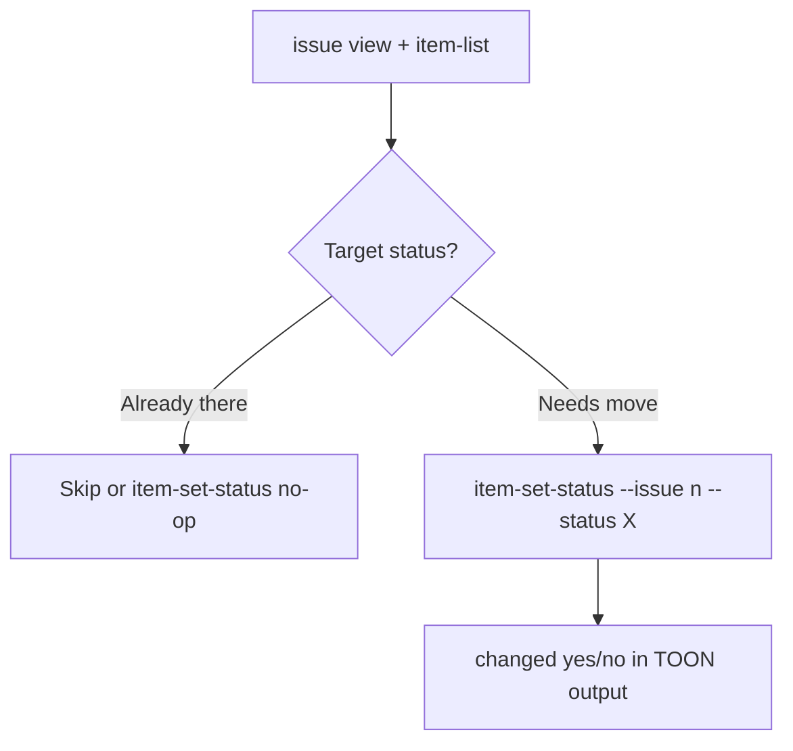

# GitHub Issues

Issue lifecycle and project-board staging on GitHub Projects v2. Depends on **gai-ghcli** from [cyphix/gaighcli](https://github.com/cyphix/gaighcli).

## Install dependency first

Install the **gai-ghcli** skill before using this skill:

```bash
npx skills add cyphix/gaighcli --skill gai-ghcli -g -y
```

After install, read the dependency skill at:

- Project: `.agents/skills/gai-ghcli/SKILL.md`
- Global (`-g`): `~/.agents/skills/gai-ghcli/SKILL.md`

Canonical source: [skills/gai-ghcli/SKILL.md](https://github.com/cyphix/gaighcli/blob/main/skills/gai-ghcli/SKILL.md)

## Prerequisites — gai-ghcli dependency

Before the first GitHub command in a session:

```bash
command -v gai-ghcli
```

1. **Prefer gai-ghcli** when on `PATH`; install with `go install github.com/cyphix/gaighcli/cmd/gai-ghcli@latest` (ensure `$HOME/go/bin` is on `PATH`). Requires `project item-set-status` — re-run install if the command is missing.
2. **Fall back to `gh`** if gai-ghcli is missing; warn once per session to install it. Do not treat a missing install as a blocker.
3. Requires [`gh`](https://cli.github.com/) authenticated (`gh auth login`). GitHub Projects need the `project` scope: `gh auth refresh -s project`.
4. Follow gai-ghcli workflow conventions: repo flags after the command, `--body-file` for markdown, secrets via stdin only, follow `help:` hints.
5. Do not pass Actions secret values via CLI flags; pipe stdin per the gai-ghcli skill.

## Board config

Commit `.github/issue-board.json` with the project number only (see [issue-board.json.example](issue-board.json.example)):

```json
{
  "projectNumber": 1
}
```

**gai-ghcli** auto-detects this file from the git root (or use `--config`). Agents read only `projectNumber` for command args — never node IDs.

`item-set-status` resolves project, field, and status option IDs from GitHub at runtime. Owner is not committed; use `ISSUE_BOARD_OWNER` or gai-ghcli defaults (repo owner / `@me`).

Optional performance cache (only if you want to skip extra API calls): add `projectId`, `statusFieldId`, and `statusOptions` from `gai-ghcli project view` and `gai-ghcli project field-list`. Not required for normal use.

### Status column convention

Expected **Status** field values (case-sensitive):

| Status | When to use |
|--------|-------------|
| Backlog | New / unscheduled |
| Ready | Selected for plan or sprint |
| In progress | Work started |
| In review | PR open or awaiting commit approval |
| Done | Merged or pushed |

## Current state — always refresh

Issue and board item state changes frequently. **Never cache issue lists or item status across user turns.**

Before any status transition on issue `#n`:

1. **Read issue:** `gai-ghcli issue view <n>`
2. **Read board item:** `gai-ghcli project item-list <project-number>` — note current status for issue `#n`
3. **Decide** target status from staging rules below
4. **Act** with one command (idempotent — reports `changed: no` if already at target):

```bash
gai-ghcli project item-set-status <project-number> --issue <n> --status Ready
```

Optional: `--title "<issue title>"` when issue number is unknown; `--config .github/issue-board.json` if not in git root.

**Never call `project item-edit` for status changes.** Use `item-set-status` only.

Re-fetch when the user mentions they changed an issue, after PR merge/review events, or when resuming work mid-session.

For PR-linked transitions also run `gai-ghcli pr view <n>` before setting **In review**, **In progress**, or **Done**.

## Status staging





| When | Move to | Agent action |
|------|---------|--------------|
| Issue filed / not yet scheduled | **Backlog** | Default for new items on the board |
| Selected for a plan or sprint | **Ready** | Move when committing to work it soon |
| Implementation starts | **In progress** | Move at start of work |
| PR opened or awaiting user commit approval | **In review** | Workflow may set **In review** on PR open when configured; agents set manually if needed before PR exists |
| PR review rejected / changes requested | **In progress** | Move back when `CHANGES_REQUESTED` or equivalent |
| PR merged or direct commit pushed | **Done** | Workflow may set **Done** on merge/push when configured; agents may set manually if CI has not run |

If current status already matches the target, do nothing. If the user moved the issue elsewhere, follow the **actual** status unless they ask you to override.

### Per-transition checklist

1. Refresh issue + board state (above)
2. If issue not on board: `gai-ghcli project item-add <project-number> --url https://github.com/<owner>/<repo>/issues/<n>` (or follow hint from failed `item-set-status`)
3. `gai-ghcli project item-set-status <project-number> --issue <n> --status <target>` when transition needed
4. Link PR with `Closes #<n>` or `Fixes #<n>` when opening a PR

## Commands

**List / triage:**

```bash
gai-ghcli project item-list <project-number> --query "status:Ready"
gai-ghcli project item-list <project-number> --query "repo:owner/repo"
gai-ghcli issue list
```

**Set status:**

```bash
gai-ghcli project item-set-status <project-number> --issue <n> --status "In progress"
gai-ghcli project item-set-status <project-number> --title "<issue title>" --status Done
```

**Create issue on board:**

```bash
gai-ghcli issue create --title "..." --body-file path.md --project "<board-title>"
```

**View / comment:**

```bash
gai-ghcli issue view <n>
gai-ghcli issue comment <n> --body-file comment.md
```

## GitHub Action

When a repo includes `.github/workflows/project-status-sync.yml`, it automates board status updates via `gai-ghcli project item-set-status`:

| Event | Transition |
|-------|------------|
| `pull_request` opened | **In review** for linked issues |
| `pull_request` closed + merged | **Done** for `Closes`/`Fixes`/`Resolves` linked issues |
| `push` to the default branch with `Fixes #n` etc. in commit messages | **Done** for direct-commit path |

Linked issues are parsed from PR title/body or pushed commit messages. Requires `.github/issue-board.json` with `projectNumber`. Configure the workflow's push branch trigger to match the repo default branch.

**CI setup:**

- Installs `gai-ghcli` in the workflow (`go install github.com/cyphix/gaighcli/cmd/gai-ghcli@latest`)
- `GH_TOKEN`: defaults to `github.token`; set repo secret `ISSUE_BOARD_TOKEN` (PAT with `project` scope) if the default token cannot write to user-owned project boards
- Optional repo variable `ISSUE_BOARD_OWNER` when the project owner differs from `github.repository_owner`

Agents should still set **Done** manually if the workflow is absent, has not run yet, or fails.
